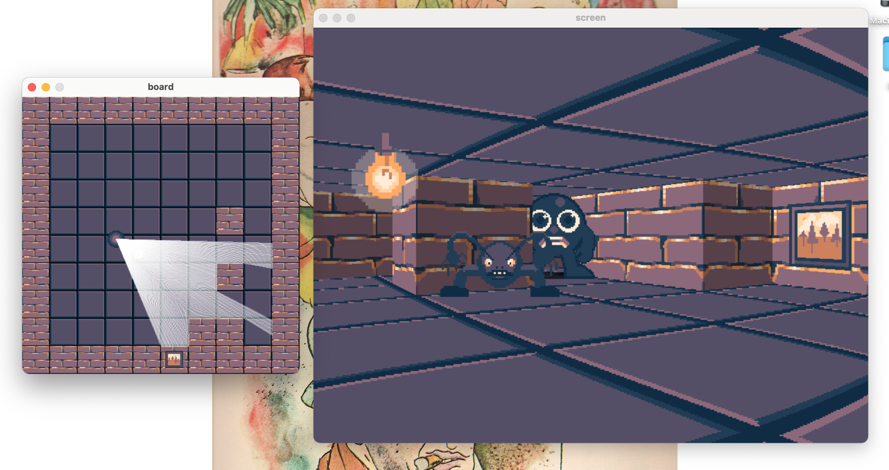

# raycast_sdl3
This is a simple raycasting program written in C with raycast_sdl3



### Controls
- Use UP/DOWN arrow keys to move player backwards and forwards
- Use LEFT/RIGHT arrow keys to turn player
- Left click anywhere in the board window to add a tile
- Right click anywhere in the board window to remove a tile
- Change current type of tile with numkeys (1: brick wall, 2: brick wall with window)

### Requirements
- SDL3
- C compiler
- CMake (if not using makefile)

### Customizing the code 
- Resolution

To change the resolution of the game, change the STEPS constant in lib/start.h
You may experience a drop in framerate if the STEPS constant is set too high.
You can fix this by reducing STEPS or by removing floor and/or ceiling rendering in lib/cast.h.
The screenshot above was taken when STEPS = 400, but STEPS = 200 by default.

- Textures

If you'd like to experiment with different textures for walls and sprites, you can edit the .bmp files
in the assets folder, or include different files by changing the path of the textures in lib/draw.h.

- Board size

If you'd like a bigger board, change the BW and BH constants in lib/start.h. Make sure BW = BH.

### Building with makefile
This should work if you're on a mac.
NOTE: The included makefile will automatically run the program
```zsh
git clone https://github.com/nfriel/raycast_v2
cd raycast_v2
make
```
If this does not work for you, ensure SDL3 is installed according to official instructions.
If you're using a PC, try changing clang to gcc

### Building with CMake
```zsh
git clone https://github.com/nfriel/raycast_v2
cd raycast_v2
mkdir build
mv assets build/assets
cmake -S src -B build
cd build
make
./nf_raycast
```
